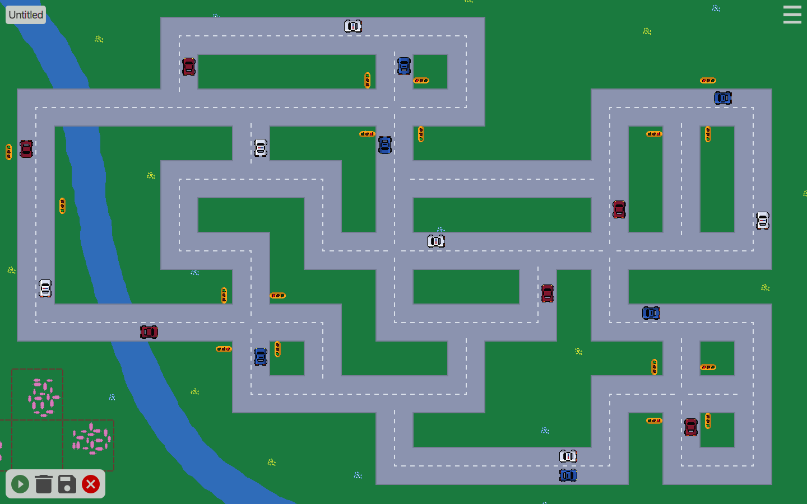

# StreetSim
Hochschule RheinMain - Medieninformatik - Softwaretechnik - Sommersemester 2020
Gruppenmitglieder: **Matteo Bentivegna, Sandra Kiefer, Jan Ningelgen, Niklas Schlögel**



## Installation und Startanweisungen
```sh
$ git clone https://scm.mi.hs-rm.de/rhodecode/2020swt/2020swt01/StreetSim
$ ./gradlew run
```
Klonen Sie das Projekt in ein beliebiges Verzeichnis von Ihnen und starten Sie die Anwendung mit Hilfe von Gradle.
Eine Beispiel-Datei in Form eines bereits erstellten Straßennetzes können Sie unter `/src/main/resources/17.json` finden und nach dem Start der Anwendung laden.

## Projektbeschreibung
Zur Unterstützung der Verkehrswende soll ein kleines Simulationssystem programmiert werden. Dieser **Verkehrssimulator** ermöglicht es ein individuelles Verkehrsnetz aus **verschiedenen Straßenabschnitten**, wie zum Beispiel Gerade, Kurven und Kreuzungen, in einem grafischen Editor zu erzeugen und platzieren. Des Weiteren können Verkehrsteilnehmer, in Form von **Autos**, auf diesem Straßennetz platziert und **simuliert fahren** gelassen werden. Autos können durch ihre **Geschwindigkeit individuell** angepasst werden. Das Programm verfügt ebenfalls über eine einfache **Kollisionserkennung** zwischen den verschiedenen Verkehrsteilnehmern. Darüber hinaus sollen am Straßenrand **Ampeln** platziert werden, welche den Verkehrsfluss regulieren. Werden keine Ampeln platziert, wird der Verkehr über die in der Straßenverkehrs-Ordnung bekannten **Vorfahrtsregeln** reguliert. Zuletzt kann der Benutzer seinen individuellen **Programmstand abspeichern** und zu einem späteren Zeitpunkt wieder **laden**.

## Dokumentation
Folgende Dokumente können im Ordner `/doku` gefunden werden:
 - **Anforderungsspezifikationen** (`/Anforderungsspezifikation.pdf`) zur detaillierten Beschreibung des Projektes
 - **Architektur-Dokument** (`/verkehrswender-design.pdf`) mit dem Konzept der softwaretechnischen Umsetzung
 - **JavaDoc** (`/javadoc/index.html`)zur näheren Beschreibung der einzelnen Funktionen